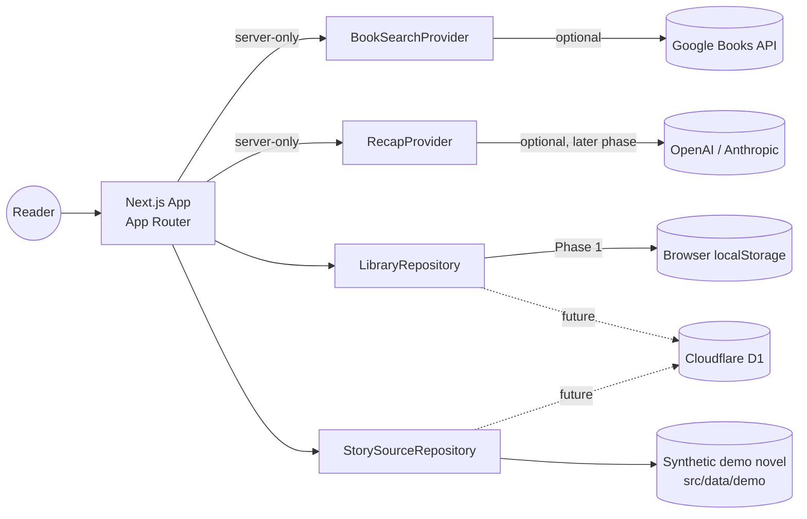
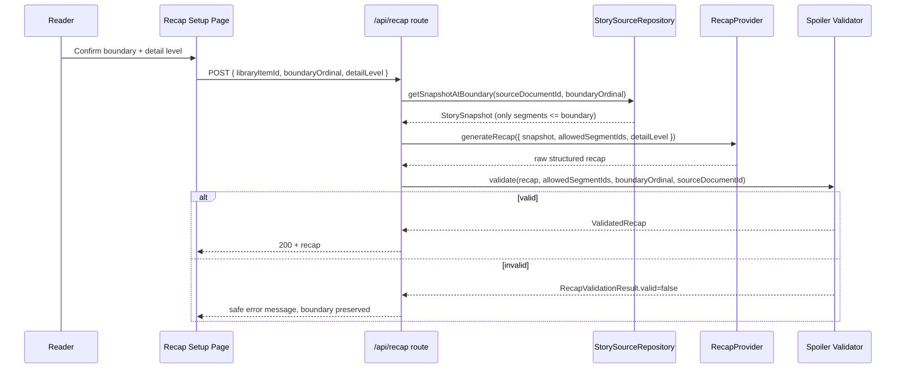

# PageCue — Architecture

## System context



## Provider boundaries

The UI never calls an external service directly. All external or stateful access goes through one of four interfaces defined in `src/domain` and implemented in `src/providers` / `src/repositories`:

- `BookSearchProvider` — `MockBookSearchProvider` (default) or `GoogleBooksProvider` (server-only, optional).
- `RecapProvider` — `MockRecapProvider` (default, deterministic, no network call). A real provider is a later-stage addition behind the same interface.
- `LibraryRepository` — `LocalLibraryRepository` (Phase 1, browser storage). `D1LibraryRepository` is a later stage.
- `StorySourceRepository` — `SyntheticStorySourceRepository` (Phase 1, in-memory demo data). `D1StorySourceRepository` is a later stage.

Selection happens via `src/config/providers.ts`, which reads environment variables (`BOOK_SEARCH_PROVIDER`, `RECAP_PROVIDER`, `LIBRARY_REPOSITORY`, `STORY_SOURCE_REPOSITORY`) and falls back to the zero-credential defaults.

## Client / server responsibilities

- **Server (Route Handlers / Server Components):** provider/repository selection, Google Books calls, recap generation + validation, anything touching an API key.
- **Client (Client Components):** guest shelf read/write (`localStorage` is browser-only), form interactivity, theme toggling, progress editor state.

No API key is ever read in a Client Component. No `NEXT_PUBLIC_` variable holds a secret.

## Local mode (Phase 1 default)

```
NEXT_PUBLIC_APP_MODE=development
BOOK_SEARCH_PROVIDER=mock
RECAP_PROVIDER=mock
LIBRARY_REPOSITORY=local
STORY_SOURCE_REPOSITORY=synthetic
```

Everything resolves without credentials: search returns deterministic mock fixtures, the demo novel ships in-repo, the shelf lives in the browser, and recaps are produced by matching a pre-authored, boundary-tagged response and validating it.

## Cloudflare mode (future)

Deploys via the OpenNext Cloudflare adapter; `LIBRARY_REPOSITORY=d1` and `STORY_SOURCE_REPOSITORY=d1` switch repositories to Cloudflare D1-backed implementations of the same interfaces, so no UI or domain code changes. See `docs/DEPLOYMENT.md`.

## Recap data flow



The provider only ever receives `allowedSegmentIds` at or below the requested boundary — later segments are not present in the request payload, so leakage is structurally bounded even before validation runs. Validation then independently re-checks every claim's supporting segment IDs against that same allow-list, because structured model output is never treated as inherently safe (build prompt §17–18).

## Error flow

Provider/network errors, schema mismatches, and validator rejections are all caught at the API boundary and turned into typed, user-safe results (`docs/SPOILER_SAFETY.md`). No stack trace, raw provider error, or source text reaches the client.

## Trust boundaries

| Boundary                | Rule                                                                                                                                                     |
| ----------------------- | -------------------------------------------------------------------------------------------------------------------------------------------------------- |
| Browser ↔ Server        | No API keys cross this boundary. Recap output is validated before crossing back.                                                                         |
| Server ↔ Google Books   | Read-only metadata only; description text is never treated as a recap source.                                                                            |
| Server ↔ Recap provider | Provider receives only the structured snapshot + allowed segment IDs, never the full book or general knowledge prompts.                                  |
| Validator ↔ everything  | The validator is the last line of defense and does not trust schema-valid output; it is implemented as plain deterministic TypeScript, not a model call. |

## Deployment view

Phase 1: `next dev` / `next build && next start`, no external services required. Future: Cloudflare Workers via OpenNext, D1 for `library_items`/`story_snapshots`/`recaps`, R2 reserved for future upload features. See `docs/DEPLOYMENT.md`.

## Source structure

```
src/
  app/            route segments (App Router)
  components/     presentational + interactive UI, grouped by domain
  config/         environment parsing, provider/repository selection
  domain/         types + pure logic (books, library, progress, story, recap)
  providers/      external adapters (book-search, recap)
  repositories/   stateful adapters (library, story-source)
  lib/            validation, storage, formatting helpers
  data/demo/      synthetic novel content
```
